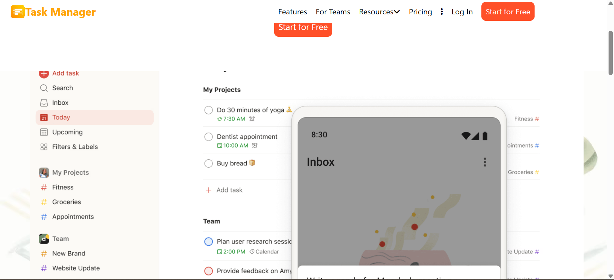
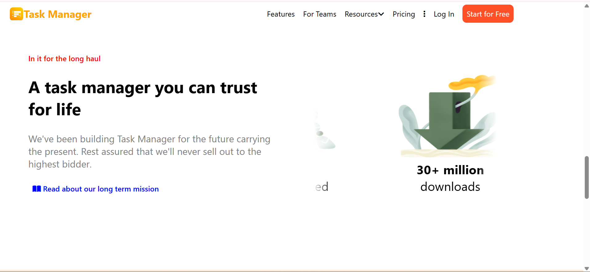
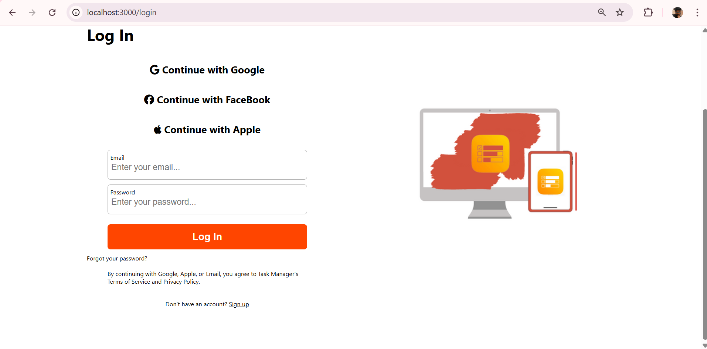
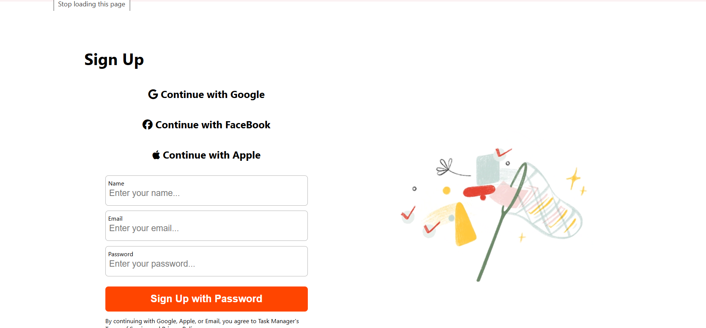

# ✅ Task Manager App

This project showcases a sleek and functional **Task Manager Web Application** built using fundamental web technologies: **HTML**, **CSS**, and **JavaScript**.

It draws inspiration from the Todoist app, incorporating classic design patterns and color schemes to give a professional and real-world feel. While the overall design is adapted, numerous modifications and additions make this project uniquely mine.

Notably, all **icons and graphics** were personally designed using **Canva**, and even the **password hashing logic** was self-written (albeit simple). The codebase is clean, readable, and modular—making it a great base for further development and collaboration.

---

## 📷 Site Images

---

## 🛠️ Tech Stack

- **HTML** – Markup structure  
- **CSS** – Custom styling and layout  
- **JavaScript** – Frontend logic and dynamic features  
- **Canva** – Custom-designed icons and images  

---

## 📂 Available Scripts

In the project directory, you can run:

### `npm start`

Runs the app in development mode.  
Open [http://localhost:3000](http://localhost:3000) in your browser to view it.

The page will reload automatically when you make changes.  
Lint errors (if any) will show up in the console.

---

## 🧠 Key Highlights

- Adapted and enhanced design inspired by **Todoist**  
- Custom-designed **icons** and **graphics** using Canva  
- Self-written logic for **simple password hashing**  
- Industry-like **UI/UX** with classic styling  

---

## 🌱 Future Scope

- Add task reminders and calendar integration  
- Implement backend with authentication and storage  
- Optimize password handling using best practices (e.g., bcrypt)  
- Improve responsiveness and accessibility  
- Add dark mode toggle

---

## 🤝 Contributions Welcome!

The project is **still in development**, and I welcome contributions of any kind. Feel free to fork, improve, or submit a pull request.

---

## 📄 License

This project is open for learning and collaboration. The design inspiration comes from **Todoist** but includes original customizations and assets.

